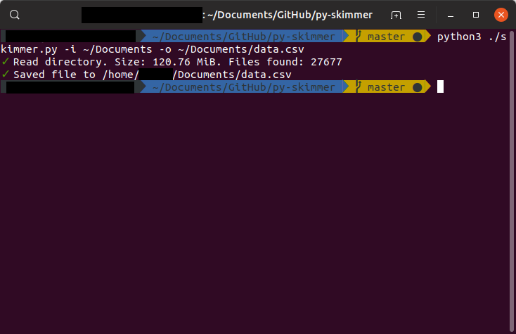
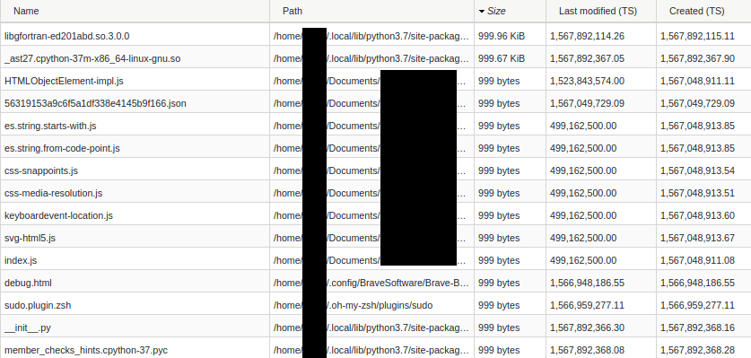

# py-skimmer
A CLU for creating a data representation of a directory's files.

### Sample Output

### Usage
```
python3 skimmer.py -i <input directory> -o <output file .csv>
```

* `input directory`: The directory to scan (e.g. `~/Documents`)
* `output file .csv`: The output file path (e.g. `~/Documents/out.csv`)
